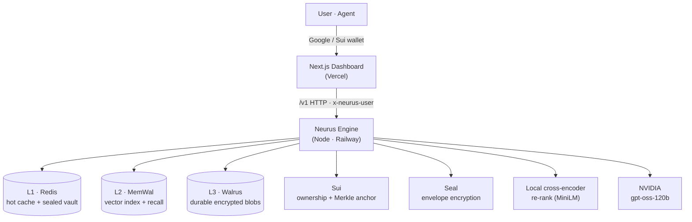

<div align="center">


# Neurus

### Owned, verifiable memory for AI agents — and a private second brain for you.

*Agents forget. Neurus remembers — on [Walrus](https://www.walrus.xyz/), encrypted with [Seal](https://github.com/MystenLabs/seal), owned on [Sui](https://sui.io/).*

[](https://sui.io/)
[](https://www.walrus.xyz/)
[](https://github.com/MystenLabs/seal)
[](https://nextjs.org)
[](https://www.typescriptlang.org/)
[](#-license)

[**Live App**](https://neurus.xyz) · [**Dashboard**](https://neurus.xyz/dashboard) · [**Blog**](https://neurus.xyz/blog)

</div>

---

## What is Neurus?

LLMs are stateless — they forget everything the moment a conversation ends, and the "memory" products that fix that hold your data hostage on someone else's server. **Neurus is a memory layer you actually own.** Capture notes, files, people, and facts; recall them by meaning; and prove they were never tampered with — because the bytes live on **Walrus** decentralized storage, encrypted with **Seal**, with ownership anchored on **Sui**.

It ships as two things on the same engine:

- **A private second brain** — sign in with Google or a Sui wallet, drop in files and notes, and ask questions that get grounded, cited answers from *your* memory.
- **A memory API for agents** — point any agent at the `/v1` HTTP API (or `npm install neuron`) and give it durable, verifiable long-term memory.

> **The thesis:** "owning your memory" is only a moat if an agent can *act* on it and anyone can *verify* it. Neurus sits **above** raw storage — it ranks, reasons over, encrypts, and proves the memory, so the data stays yours and stays trustworthy.

---

## Features

### For everyone — the second brain
- **Drop & Ask** — upload PDFs, docs, Markdown, web pages, or GitHub repos; ask in natural language; get answers grounded in your own content with inline citations.
- **Semantic recall** — find things by *meaning*, not keywords (broad vector recall + a local cross-encoder re-rank).
- **You own it** — sign in with Google (hosted account) **or** a Sui wallet to self-custody your memory on Walrus.
- **Proactive nudges** — reflection generates insight-neurons; Telegram alerts keep you in the loop.
- **Private by construction** — bodies are Seal-encrypted; you can revoke and delete.

### For developers — the agent memory layer
- **Drop-in `/v1` HTTP API** — `remember`, `recall`, `ask` (streaming), `retrieve`, `forget`, and more.
- **Knowledge sets** — namespaced, shareable, optionally verifiable collections of memory.
- **Verifiable integrity** — publish a Merkle-rooted manifest, anchor it on Sui, and restore/verify any time.
- **Embeddable widgets** — expose a read-only "ask" widget for a set on your own site.
- **Multi-tenant by design** — every user writes to their *own* MemWal namespace/account; the engine never co-mingles data.

---

## 🏛️ Architecture

Two deploys, one engine. The Next.js app is static/serverless on Vercel; the engine is a long-running Node service (it holds in-memory state and an ML re-ranker, so it can't be serverless).



**The tiered memory:**

| Tier | Role | Backed by |
|------|------|-----------|
| **L1** | Hot cache + per-user credential vault | Upstash **Redis** (optional; falls back to disk) |
| **L2** | Vector index for semantic recall | **MemWal** (Walrus Memory) |
| **L3** | Durable, encrypted source of truth | **Walrus** blobs |
| **Trust** | Ownership, access control, integrity anchor | **Sui** + **Seal** |

---

## How memory works

```
capture ─▶ extract neurons ─▶ embed + encrypt ─▶ store (Walrus / MemWal)
                                                        │
ask ◀── grounded answer (cited) ◀── re-rank ◀── broad recall (MemWal)
```

1. **Capture** a note, file, or page → the engine extracts *neurons* (memory nodes: people, notes, files, chunks, insights, commitments).
2. **Store** — bodies go to Walrus (Seal-encrypted) + MemWal for vector recall; a versioned manifest tracks the map.
3. **Recall** — MemWal returns a broad candidate pool; a local cross-encoder (`Xenova/ms-marco-MiniLM-L-6-v2`) re-ranks for precision.
4. **Answer** — NVIDIA `gpt-oss-120b` produces a streamed, grounded answer that cites the exact evidence it was given.

---

## The Dashboard

A developer-console-meets-second-brain workspace (think Langfuse/Braintrust, for owned memory).

| Tab | What it does |
|-----|--------------|
| **Overview** | Live stats, memory composition, durability + first-run guidance |
| **Neurons** | Every memory written, live — type, trust, durability; inspect & forget |
| **Ask** | Streaming research-chat over a set with clickable evidence citations |
| **Second Brain** | Capture notes, generate insights (reflect), browse your feed |
| **Sets** | Create/switch knowledge sets, manage visibility, mark verified |
| **Datasets** | Upload files / import Walrus blobs, see **Memory Health** (certified on Sui, epochs left), renew |
| **Connect** | API key + `npm install neuron` snippet to wire up an agent |

Plus: split **login** (Google + wallet), profile with **"Own my memory on Walrus,"** Telegram connect, and embeddable widgets.

---

## Tech stack

**Web** · Next.js 16 (App Router) · React 19 · TypeScript · Tailwind · NextAuth v5 (Google) · `@mysten/dapp-kit` (Sui wallets) · TanStack Query

**Engine** · Node (≥22) · TypeScript · `@mysten-incubation/memwal` · `@mysten/sui` · `@mysten/seal` · `@huggingface/transformers` (cross-encoder re-rank) · `unpdf` / `mammoth` / `jsdom` (ingest) · `zod`

**Infra** · Vercel (web) · Railway/Render/Fly (engine) · Upstash Redis (cache + vault) · NVIDIA-hosted LLM · Walrus + Sui (testnet/mainnet)

---

## Project structure

```
neurus/
├── src/                      # Next.js web app (landing + dashboard) → Vercel
│   ├── app/
│   │   ├── login/            # split Google + wallet sign-in
│   │   ├── dashboard/        # Overview · Neurons · Ask · Brain · Sets · Datasets · Connect
│   │   └── api/auth/         # NextAuth route
│   ├── components/           # landing + shared providers (Auth, Sui)
│   ├── services/neurus.ts    # typed client over the engine /v1 API
│   └── lib/                  # auth config, session identity
│
├── neuron/                   # the engine → Railway/Render/Fly
│   └── src/
│       ├── core/             # memory, sets, datasets (neurons + namespaces)
│       ├── ingest/           # files, dirs, web, github, walrus
│       ├── retrieval/        # recall + cross-encoder re-rank
│       ├── reason/           # grounded, streaming answers
│       ├── proactive/        # reflect (insights) + surface (nudges)
│       ├── integrity/        # Merkle manifest, Sui anchor, blob health
│       ├── identity/         # per-user accounts, sealed vault, provisioning
│       ├── access/           # Seal encryption
│       ├── storage/          # Walrus + MemWal + Redis KV
│       ├── crdt/             # shared multi-writer sets
│       ├── notify/           # Telegram
│       └── api/server.ts     # /v1 HTTP server
└── public/
```

---

## API reference (`/v1`)

| Group | Endpoints |
|-------|-----------|
| **Health** | `GET /health` |
| **Memory** | `POST /remember` · `POST /recall` · `POST /retrieve` · `POST /ask` · `POST /ask/stream` · `POST /forget` |
| **Ingest** | `POST /ingest/file` · `/ingest/dir` · `/ingest/walrus` |
| **Datasets** | `GET /datasets` · `POST /datasets/{upload,import,web,github,folder,publish,health,renew}` |
| **Sets & map** | `GET /sets` · `POST /sets` · `GET /map` · `GET /neurons` |
| **Proactive** | `POST /reflect` · `POST /surface` · `POST /brief` |
| **Integrity** | `POST /publish` · `POST /restore` · `POST /flush` |
| **Ownership** | `GET /account` · `POST /account/{link,provision,unlink}` |
| **Widgets** | `GET /widgets` · `POST /widgets` · `/widgets/delete` · `GET /public/widget` · `POST /public/ask/stream` |
| **Notify** | `GET /notify` · `POST /notify/telegram` · `/notify/test` |

Every request carries an `x-neurus-user` header that scopes it to that user's namespace/account.

---

## 🔒 Security & trust

Memory bodies are **Seal-encrypted** at rest on Walrus; the per-user credential vault is sealed with `NEURON_VAULT_KEY`. Ownership is enforced by MemWal's owner/delegate model on Sui — access is **revocable and verifiable**.

> **Current limitation:** the engine trusts the client-set `x-neurus-user` header (CORS open), so cross-user isolation is functional but not yet cryptographically enforced. Hardening it (signed identity / JWT) is on the roadmap. Don't put untrusted production secrets behind it until then.

---

## 📄 License

Released under the **MIT License**.

<div align="center">
<sub>Built on <a href="https://www.walrus.xyz/">Walrus</a> · <a href="https://sui.io/">Sui</a> · <a href="https://github.com/MystenLabs/seal">Seal</a> · MemWal</sub>
</div>
