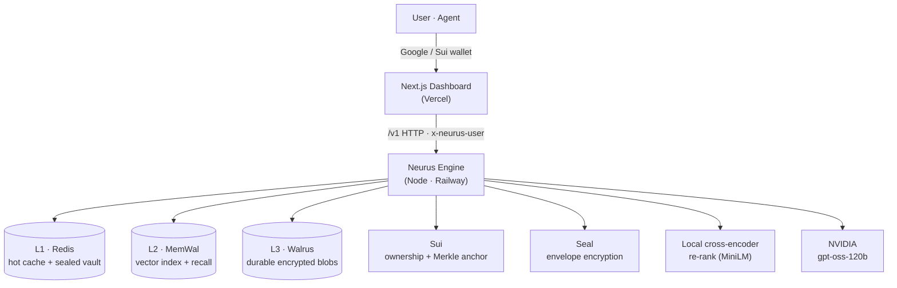
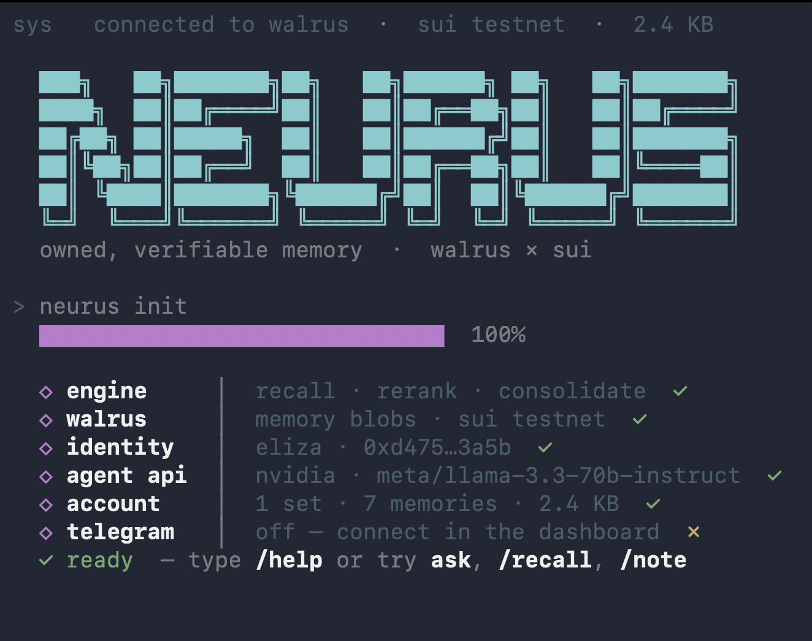

<div align="center">


# Neurus

### Owned, verifiable memory for AI agents — and a private second brain for you.

*Agents forget. Neurus remembers — on [Walrus](https://www.walrus.xyz/), encrypted with [Seal](https://github.com/MystenLabs/seal), owned on [Sui](https://sui.io/).*

[](https://sui.io/)
[](https://www.walrus.xyz/)
[](https://github.com/MystenLabs/seal)
[](https://nextjs.org)
[](https://www.typescriptlang.org/)
[](#-license)
[](https://www.npmjs.com/package/neurus)

[**Live App**](https://neurus.xyz) · [**Dashboard**](https://neurus.xyz/dashboard) · [**Blog**](https://neurus.xyz/blog)

</div>

---

## What is Neurus?

Every LLM forgets the moment you close the tab. The products that "fix" this keep your memory on their servers, in their format, tied to their model. Leave, and it doesn't come with you.

Neurus is memory you own. Write notes, files, people, and facts once; recall them by meaning; and carry them between Claude, Gemini, and GPT without re-explaining yourself. The bytes live on **Walrus**, encrypted with **Seal**, with ownership anchored on **Sui** — so the memory is yours, portable, and provably untampered.

One engine, three ways in:

- **Second brain** — sign in with Google or a Sui wallet, drop in files and notes, ask in plain language, get cited answers from *your* memory.
- **CLI** — `neurus agent` spins up a personal memory agent in your terminal with its own Sui identity. No browser, no account.
- **Agent memory API** — point any agent at the `/v1` HTTP API, `npm install neuron`, or plug in over **MCP** / **A2A**. Durable, verifiable long-term memory in a few lines.

> **Why it matters:** owning your memory is only a moat if an agent can *act* on it and anyone can *verify* it. Neurus sits **above** raw storage — it ranks, reasons, encrypts, and proves. And because the memory is model-agnostic, the models become interchangeable: swap providers mid-task and the context follows, with full provenance of which model wrote what. No lock-in.

---

## Features

### The second brain
- **Drop & Ask** — feed it PDFs, docs, Markdown, web pages, or whole GitHub repos. Ask in plain language. Get answers grounded in your own content, with the exact evidence behind every claim.
- **Semantic recall** — finds things by meaning, not keyword matching: broad vector recall, then a local cross-encoder re-rank for precision.
- **It's actually yours** — Google for a hosted account, or a Sui wallet to self-custody every byte on Walrus.
- **Proactive, not passive** — sleep-time reflection turns scattered notes into insight-neurons; Telegram pings you about what matters.
- **Calendar both ways** — pull Google Calendar into memory, or write a note about a meeting and Neurus books the event.
- **Private by construction** — bodies are Seal-encrypted; revoke and delete are real, not settings toggles.

### The CLI
- **Births its own agent** — `neurus agent` generates a Sui keypair whose address *is* its Walrus memory namespace. One command, no signup.
- **A REPL over your memory** — chat, `/plan` a goal, `/recall`, `/note`, `/add` a file, or `@` to browse and ask over any file in the folder.
- **Share across machines** — `/share` seals a set into a Seal-gated feed, `/grant <addr>` allowlists a reader, `/follow` imports one. Memory you grant on your laptop shows up in a teammate's agent.
- **Talks like a person** — it understands "share this with 0x…" or "follow this feed" in plain English; no flag syntax required.

### The agent memory layer
- **Drop-in `/v1` HTTP API** — `remember`, `recall`, `ask` (streaming), `retrieve`, `forget`, and more.
- **Model-agnostic context router** — one owned memory across every model; swap Claude, Gemini, or GPT mid-session and the context carries, tagged with which model wrote what (`neuron/src/reason/router.ts`).
- **Learns on the job** — every task records its outcome and distills a reusable *skill* neuron: a procedure with a win/loss-weighted confidence, retrieved before the next similar task. Memory stops being a static library and starts compounding — answers get better at your recurring questions over time, and because skills are owned and portable, that earned competence follows you across models (`neuron/src/proactive/skills.ts`).
- **Never errors out on free users** — NVIDIA first, then a silent OpenRouter free-model fallback, then the top memory itself. Rate limits never reach the user.
- **Open interop** — serve your memory as **MCP** tools (Claude Code / Cursor / Desktop) or answer as a discoverable **A2A** agent. No context copying between vendors.
- **Knowledge sets** — namespaced, shareable, optionally verifiable collections of memory.
- **Verifiable integrity** — publish a Merkle-rooted manifest, anchor it on Sui, restore or verify any time.
- **Embeddable widgets** — drop a read-only "ask" widget for any set onto your own site.
- **Multi-tenant by design** — every user writes to their own MemWal namespace. The engine never co-mingles data.

---

## 🏛️ Architecture

Two deploys, one engine. The Next.js app is static/serverless on Vercel; the engine is a long-running Node service (it holds in-memory state and an ML re-ranker, so it can't be serverless).



**The tiered memory:**

| Tier | Role | Backed by |
|------|------|-----------|
| **L1** | Hot cache + per-user credential vault | Upstash **Redis** (optional; falls back to disk) |
| **L2** | Vector index for semantic recall | **MemWal** (Walrus Memory) |
| **L3** | Durable, encrypted source of truth | **Walrus** blobs |
| **Trust** | Ownership, access control, integrity anchor | **Sui** + **Seal** |

---

## How memory works

```
capture ─▶ extract neurons ─▶ embed + encrypt ─▶ store (Walrus / MemWal)
                                                        │
ask ◀── grounded answer (cited) ◀── re-rank ◀── broad recall (MemWal)
```

1. **Capture** a note, file, or page → the engine extracts *neurons* (memory nodes: people, notes, files, chunks, insights, commitments, skills).
2. **Store** — bodies go to Walrus (Seal-encrypted) + MemWal for vector recall; a versioned manifest tracks the map.
3. **Recall** — MemWal returns a broad candidate pool; a local cross-encoder (`Xenova/ms-marco-MiniLM-L-6-v2`) re-ranks for precision.
4. **Answer** — NVIDIA `gpt-oss-120b` produces a streamed, grounded answer that cites the exact evidence it was given.
5. **Learn** — the task's outcome is recorded and distilled into a *skill* neuron (`act → outcome → distill → retrieve`), which is primed into the next similar task so the agent develops instead of staying flat.

---

## The Dashboard

A developer-console-meets-second-brain workspace (think Langfuse/Braintrust, for owned memory).

| Tab | What it does |
|-----|--------------|
| **Overview** | Live stats, memory composition, durability + first-run guidance |
| **Neurons** | Every memory written, live — type, trust, durability; graph view, inspect, forget, restore index |
| **Ask** | Streaming research-chat over a set with clickable evidence cards and conflict detection |
| **Second Brain** | Capture notes, sync/write Google Calendar, generate insights (reflect) |
| **Sets** | Create/switch knowledge sets, snapshot to Walrus, import by blob ID |
| **Datasets** | Upload files / web / GitHub / folders, **Memory Health** (certified on Sui, epochs left), renew, widgets |
| **Agents** | Define dataset-bound Q&A agents and ask them inline |
| **Network** | Describe a workflow in plain English, run live DeFi/price agents, grant write-access, log & grade trading plays |

Plus: split **login** (Google + wallet), profile with **"Own my memory on Walrus,"** Telegram connect, and embeddable widgets.

---

## The CLI

A full memory agent in your terminal — no browser, no account. `neurus agent` generates a Sui identity on first run and drops you into a REPL grounded in your own Walrus memory.

<div align="center">

</div>

The CLI is **published on npm** as [`neurus`](https://www.npmjs.com/package/neurus):

```bash
npm install -g neurus      # published on npm · or run once with: npx neurus
neurus                     # first run: creates a Sui wallet, auto-provisions your
                           #   Walrus memory account from the faucet, opens the REPL

# optional
neurus setup               # save MemWal credentials for the MCP server
claude mcp add neurus neurus-mcp --scope user
```

> First launch needs no signup and no manual setup — `neurus` mints a wallet whose
> address *is* your Walrus memory namespace and funds it from the testnet faucet.
> `neurus setup` is only for wiring the MCP server into Claude Code / Cursor.

| Command | What it does |
|---------|--------------|
| `agent` | Interactive REPL — chat, plan, recall, and write over a set's memory |
| `note "<text>"` | Remember a note (extracts people, facts, commitments) |
| `add <file\|dir>` | Store a file or folder on Walrus and index it (txt/md/csv/json/pdf/docx) |
| `ask "<question>"` | Grounded, cited answer from the set |
| `brief <name>` · `nudges` · `reflect` · `surface` | Pre-meeting brief, open loops, insights, what to act on now |
| `publish` / `restore` / `restore-index` | Snapshot to Walrus, restore a manifest, rebuild the vector index |
| `follow <blobId> --share <id>` | Import a Seal-gated shared feed into a set |
| `whoami` | Show this agent's Sui address — share it to get granted access |

**Inside the REPL:** `/plan <goal>` · `/recall <q>` · `/note` · `/add` · `@` file picker · `/share [name]` · `/grant <addr>` · `/follow` · `/set <name>` · `/model` · `/help`. It also reads plain-English intent — "share this set with 0x…" works without any flags.

---

## Embeddable widgets

Turn any set — or a single dataset inside it — into a read-only "Ask AI" chat bubble on your own site. Build it in the **Datasets** tab (name it, optionally bind it to one dataset, set allowed origins), then paste one line:

```html
<script src="https://your-engine/embed.js" data-widget="WIDGET_ID" defer></script>
```

That drops a floating button in the corner; clicking it opens a chat panel that answers, with citations, only from the memory you scoped to it.

- **Read-only** — visitors can ask, never write. No memory leaves the set you chose.
- **Origin-locked** — requests are rejected unless they come from a domain on the widget's allowlist (`POST /v1/public/ask/stream` checks `Origin`).
- **Scoped** — bind to a whole set or narrow to one dataset, so a docs widget only ever answers from the docs.
- **Same grounded answers** — streaming, cited, conflict-aware — just without the dashboard around it.

---

## API reference (`/v1`)

| Group | Endpoints |
|-------|-----------|
| **Health** | `GET /health` |
| **Memory** | `POST /remember` · `POST /recall` · `POST /retrieve` · `POST /ask` · `POST /ask/stream` · `POST /forget` |
| **Ingest** | `POST /ingest/file` · `/ingest/dir` · `/ingest/walrus` |
| **Datasets** | `GET /datasets` · `POST /datasets/{upload,import,web,github,folder,publish,health,renew}` |
| **Sets & map** | `GET /sets` · `POST /sets` · `GET /map` · `GET /neurons` |
| **Proactive** | `POST /reflect` · `POST /surface` · `POST /brief` |
| **Integrity** | `POST /publish` · `POST /restore` · `POST /flush` |
| **Ownership** | `GET /account` · `POST /account/{link,provision,unlink}` |
| **Widgets** | `GET /widgets` · `POST /widgets` · `/widgets/delete` · `GET /public/widget` · `POST /public/ask/stream` |
| **Interop** | `GET /a2a/{id}/.well-known/agent-card.json` · `POST /a2a/{id}` (A2A JSON-RPC `message/send`) — plus an **MCP** stdio server (`neurus-mcp`) exposing `list_sets` · `recall` · `ask` · `remember` · `create_feed` · `grant_feed` · `list_feeds` · `share_set` · `inspect_share` |
| **Notify** | `GET /notify` · `POST /notify/telegram` · `/notify/test` |

Every request carries an `x-neurus-user` header that scopes it to that user's namespace/account.

---

## 🔒 Security & trust

Memory bodies are **Seal-encrypted** at rest on Walrus; the per-user credential vault is sealed with `NEURON_VAULT_KEY`. Ownership is enforced by MemWal's owner/delegate model on Sui — access is **revocable and verifiable**.

---

## 📄 License

Released under the **MIT License**.

<div align="center">
<sub>Built on <a href="https://www.walrus.xyz/">Walrus</a> · <a href="https://sui.io/">Sui</a> · <a href="https://github.com/MystenLabs/seal">Seal</a> · MemWal</sub>
</div>
